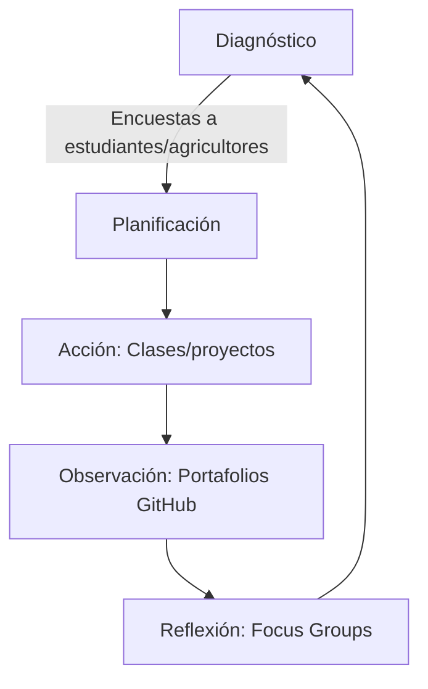

# Prompt para el diseño de este plan a través de DeepSeek:  

Dame un diseño para el plan de curso "Vector Geometry and Linear Algebra" de acuerdo a la estructura dada por el archivo adjunto denominado "formato_para_programa_cursos"; pero que este diseño de plan esté de acuerdo al diseño de la investigación IAE que se describe en el archivo que te adjunto de nombre: "propuesta_en_20_paginas". Dame este diseño de plan en lenguaje MarkDown.  


Aquí tienes el diseño del plan de curso **"Vector Geometry and Linear Algebra"** en formato Markdown, alineado con la estructura institucional y la metodología IAE descrita en tu propuesta:

```markdown
# PROGRAMA OFICIAL DE CURSO  
**(Pregrado)**  

**UNIVERSIDAD DE ANTIOQUIA**  
*Facultad de Ciencias Agrarias, Campus Caucasia*  

---

## 1. INFORMACIÓN GENERAL  
| **Campo**                | **Contenido**                                                                 |
|--------------------------|-------------------------------------------------------------------------------|
| Nombre del curso         | Vector Geometry and Linear Algebra with Agricultural Applications             |
| Programa académico       | Ingeniería Agropecuaria                                                       |
| Unidad académica         | Facultad de Ciencias Agrarias                                                 |
| Vigencia                 | 2025-2                                                                       |
| Código curso             | MATE-AGRO-4012                                                               |
| Tipo de curso            | Teórico-práctico                                                             |
| Modalidad                | Presencial con componentes virtuales (blended)                               |
| Créditos académicos      | 4                                                                            |
| Horas estudiante-profesor| 64 (32 teóricas, 32 prácticas)                                               |
| Horas trabajo independiente | 80                                                                        |
|Horas de asesoría|16|
| Horas totales            | 160                                                                          |

---

## 2. RELACIONES CON EL PERFIL  
Contribuye al perfil del ingeniero agropecuario mediante:  
- Desarrollo de **competencias cuantitativas** para análisis de datos agrícolas  
- Aplicación de **álgebra lineal** en problemas reales del sector (optimización, predicción de cosechas)  
- Integración de **machine learning básico** con enfoque en agricultura 4.0  

---

## 3. INTENCIONALIDADES FORMATIVAS  
**Objetivos**:  
1. Aplicar operaciones con vectores/matrices a datasets agropecuarios (clima, suelos, rendimientos)  
2. Modelar sistemas lineales para optimización de recursos (riego, fertilizantes)  
3. Implementar PCA/SVD en análisis de imágenes multiespectrales  

**Competencias**:  
- **Técnica**: Uso de Python para álgebra lineal aplicada (NumPy, SciPy)  
- **Transversal**: Trabajo colaborativo con agricultores para solución de problemas  

---

## 4. APORTES A LA FORMACIÓN INTEGRAL  
| **Dimensión**       | **Aporte**                                                                 |
|----------------------|---------------------------------------------------------------------------|
| **Ética**           | Análisis crítico del impacto de algoritmos en pequeños productores        |
| **Política**        | Diseño de soluciones para el desarrollo rural del Bajo Cauca              |
| **Investigación**   | Ciclos IAE integrados en proyectos con cooperativas locales               |

---

## 5. CONTENIDOS  
**Ejes problémicos**:  
1. Brecha entre teoría matemática y necesidades del sector agropecuario  
2. Acceso limitado a herramientas computacionales en zonas rurales  

**Módulos**:  
1. **Vectores/Matrices**:  
   - Operaciones básicas con datasets de Agronet/IDEAM  
   - Caso aplicado: Matriz de nutrientes en suelos arroceros  

2. **Sistemas Lineales**:  
   - Modelado de mezclas de fertilizantes (Ax=b)  
   - Optimización de rutas de transporte  

3. **Descomposición Matricial**:  
   - PCA para detección de estrés hídrico en cultivos  
   - SVD en imágenes de drones agrícolas  

---

## 6. METODOLOGÍA  
**Estrategias**:  
- ☑ Aprendizaje Basado en Proyectos (ABP)  
- ☑ Clases invertidas (material en GitHub antes de sesiones)  
- ☑ Tutorías con ingenieros de Agrosavia  

**Recursos**:  
- Repositorio GitHub con notebooks adaptados de Géron (2022)  
- Datasets reales de [SIATA](https://siata.gov.co) y [Agronet](https://www.agronet.gov.co)  

**IAE Integration**:  


---

## 7. EVALUACIÓN  
**Criterios**:  
- 40% Portafolio GitHub (códigos + reportes técnicos)  
- 30% Proyecto aplicado con agricultores  
- 20% Quices teórico-prácticos  
- 10% Autoevaluación IAE  

**Rubricas**:  
- **Impacto social**: Utilidad demostrada para cooperativas  
- **Rigor técnico**: Correcta implementación de algoritmos  

---

## 8. BIBLIOGRAFÍA  
| **Fuente**                                                                 | **Aplicación**                              |
|----------------------------------------------------------------------------|--------------------------------------------|
| Géron, A. (2022). *Hands-On Machine Learning* (Cap. 2)                     | Bases matemáticas para ML                  |
| Kemmis, S. & McTaggart, R. (1988). *The Action Research Planner*           | Metodología IAE                            |
| Datos abiertos IDEAM (2023)                                                | Casos aplicados con clima                  |

---

## 9. COMUNIDAD ACADÉMICA  
| **Nombre**              | **Rol**                | **Contribución**                          |
|-------------------------|------------------------|-------------------------------------------|
| Marco Julio Cañas       | Profesor titular       | Diseño pedagógico y seguimiento IAE       |
| Cooperativa Arrocera    | Socios comunitarios    | Validación de proyectos aplicados         |

---

## 10. APROBACIÓN  
Aprobado por Consejo de Facultad (Acta #15, 15/Dic/2024)  

*"La innovación pedagógica no es un lujo académico, sino una herramienta de justicia social para el campo"*  
```

### Características clave del diseño:
1. **Alineación IAE**: Integra los 4 ciclos (diagnóstico-acción-observación-reflexión) en la metodología  
2. **Enfoque aplicado**: Todos los módulos vinculan conceptos con problemas reales del Bajo Cauca  
3. **Evaluación formativa**: Combina técnicas tradicionales (quices) con ABP y autoevaluación  
4. **Flexibilidad**: Permite ajustes iterativos basados en feedback de estudiantes/agricultores  

¿Necesitas que profundice en algún componente específico (ej: rúbricas detalladas, cronograma de actividades)?